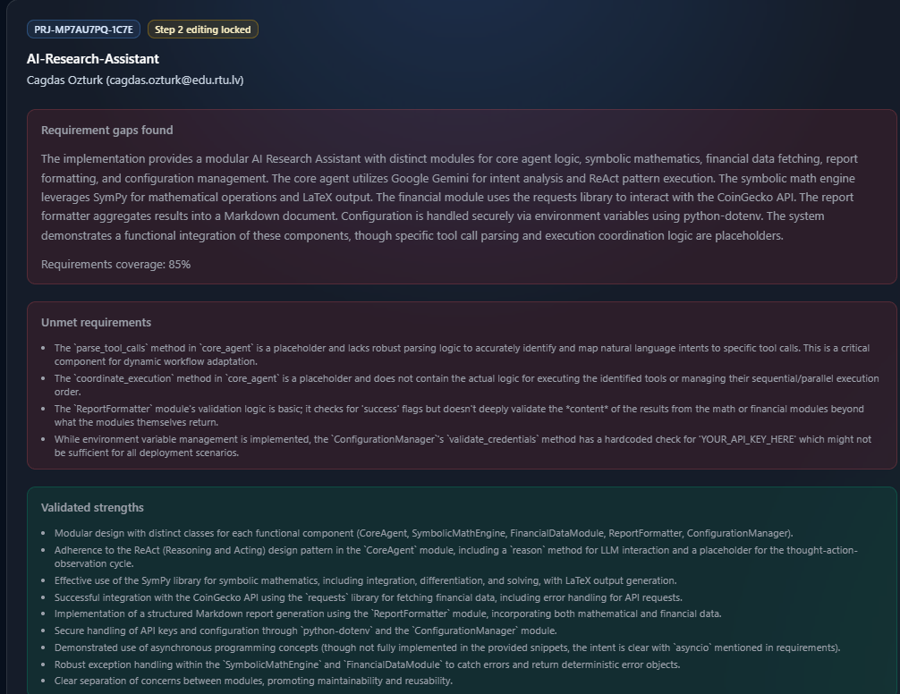

Report 1

Project Concept / Vision Report
Align stakeholders on what is being built and why.

Based on: Short system description
Based on: System goal
Based on: AI / agent approach
Problem Statement

University students, engineering students, and researchers require reliable assistance with symbolic mathematics, technical problem-solving, and academic documentation. Traditional AI assistants often suffer from 'hallucinations,' producing unverifiable mathematical results, which is unacceptable in academic and technical contexts.

System Goal

To provide a robust AI-powered research assistant that delivers mathematically verified symbolic results, step-by-step derivations, graphs, formatted LaTeX equations, and structured academic explanations. The system aims to minimize hallucinations by leveraging a dedicated symbolic computation engine and integrating with factual APIs like CoinGecko for real-time data, thereby supporting advanced academic and technical work with verifiable outputs.

Innovation / AI Approach

The system's innovation lies in its use of a Single Intelligent Agent employing the ReAct (Reasoning and Acting) framework, powered by the Google Gemini LLM. This agent utilizes Chain-of-Thought reasoning to semantically analyze natural language queries and dynamically coordinate specialized tools, including a WolframAlpha-style Symbolic Math Engine and the CoinGecko API. This approach ensures deterministic, verified outputs and prevents common AI hallucinations by intelligently selecting and executing the most appropriate tools for each task.

Target Audience

University students, engineering students, and researchers who require precise computational assistance for their academic and technical projects.

Key Differentiators

Focus on verifiable mathematical accuracy, step-by-step derivations, integration of symbolic computation with real-time data, and a dynamic AI agent that adapts to complex user requests, directly addressing the hallucination problem.

Report 2

Technical Feasibility Report
To assess the practicality and viability of building the AI-Research-Assistant system based on the proposed technologies and approach.

Based on: Tools list
Based on: Programming concepts
Based on: AI / agent approach
Tool Availability and Compatibility

The core tools are readily available and compatible. Google Gemini LLM is accessible via API. SymPy is a mature and widely used Python library for symbolic mathematics. The `requests` library for CoinGecko API integration is standard. `python-dotenv` is a common utility. Compatibility is high, with Python 3.11 as the chosen environment.

Programming Complexity

The project involves moderate programming complexity. Implementing the ReAct pattern with an LLM requires careful state management and prompt engineering. Integrating multiple tools, especially asynchronously, adds complexity. However, the use of OOP and established libraries like SymPy and `asyncio` mitigates this. The Decorator Pattern for the ToolRegistry is a well-understood design pattern.

AI Risks and Mitigation

The primary AI risk is LLM hallucination or incorrect tool selection/parameter generation. This is mitigated by the ReAct framework's iterative reasoning and the system's explicit goal of verifiable outputs. The use of a dedicated symbolic engine (SymPy) for mathematical tasks, rather than relying solely on the LLM for calculations, is a key strategy to prevent mathematical hallucinations. Chain-of-Thought reasoning further enhances predictability. However, ensuring the LLM consistently generates valid tool calls for complex queries remains a challenge.

Integration Challenges

Integrating the Gemini LLM with the ReAct loop and ensuring seamless communication with the SymPy engine and CoinGecko API are the main integration challenges. Managing asynchronous calls and parsing diverse output formats (LLM JSON, SymPy LaTeX, CoinGecko JSON) requires robust error handling and data transformation logic. The Markdown Formatter needs to correctly aggregate and present these varied outputs.

Required Infrastructure

The system requires a Python 3.11 environment with necessary libraries installed. Access to the Google Gemini API (requiring an API key and potentially associated costs) is essential. For development and testing, a local machine with sufficient resources to run Python and potentially the LLM inference (if not purely API-based) is needed. Deployment would require a server capable of running Python applications and making external API calls.

Overall Feasibility Assessment

The project is technically feasible. The chosen tools are appropriate and available. The programming concepts are well-suited for the task. The primary risks are manageable through careful design and implementation, particularly the LLM's role in orchestration rather than direct computation for critical tasks. The system's focus on verifiable outputs through dedicated engines is a strong point for feasibility.

Report 3

System Architecture Overview
Define how the system will work structurally.

Based on: AI / agent approach
Based on: Tools list
Based on: Programming concepts
Architecture Style

The system adopts a modular, agent-driven architecture. A central AI agent acts as the orchestrator, coordinating specialized tools. This aligns with microservices principles in its modularity and a reactive approach in its agent's decision-making.

Major Components/Services

The core components are: the Gemini LLM Agent (the 'brain'), the Symbolic Math Engine (powered by SymPy), the CoinGecko API Client, and the Markdown Formatter. A ToolRegistry manages the mapping between agent decisions and tool execution.

Design Patterns

Key design patterns include the ReAct (Reasoning and Acting) pattern for the agent's decision-making loop, Object-Oriented Programming (OOP) for component structure, Asynchronous Programming (asyncio) for concurrent operations, and the Decorator pattern for efficient tool registration within the ToolRegistry.

Data Flow

User natural language queries are received by the Gemini Agent. The agent analyzes the query, determines required tools, and generates structured calls. These calls are sent to the respective tools (Symbolic Math Engine or CoinGecko API). Tool outputs are returned to the agent, which then uses the Markdown Formatter to compile a final, structured academic report. Error handling is integrated at each step to ensure data integrity and system stability.

Report 4

Requirements Specification (Draft)
Translate the idea into clear system requirements.

Based on: SYSTEM GOAL
Based on: AI / AGENT APPROACH
Based on: TOOLS
Functional Requirements

The system SHALL accept natural language queries from users. The system SHALL parse mathematical expressions and provide step-by-step symbolic solutions. The system SHALL retrieve real-time cryptocurrency market data. The system SHALL generate outputs in LaTeX format for mathematical equations. The system SHALL produce structured academic explanations. The system SHALL combine results from multiple tools into a single Markdown report.

Non-Functional Requirements

The system SHALL aim for a response time of under 3 seconds for typical queries. The system SHALL minimize AI hallucination by relying on deterministic computation engines. The system SHALL be stable and handle errors gracefully. The system SHALL securely manage API keys.

Constraints

The system SHALL utilize Google Gemini LLM as its primary AI model. The system SHALL use SymPy for its Symbolic Math Engine. The system SHALL integrate with the CoinGecko API. The system SHALL be developed in Python 3.11.

Dependencies

The system is dependent on the availability and functionality of the Google Gemini API and the CoinGecko API. It also depends on the Python 3.11 runtime environment and installed libraries (SymPy, requests, google-generativeai, python-dotenv).

Success Criteria

Successful execution of at least 90% of common mathematical and financial queries with accurate, verifiable results. User satisfaction surveys indicating the system effectively assists with academic and technical tasks. Absence of significant AI hallucination in generated outputs.

Report 5

AI / Agent Design Report
Explain how intelligence is implemented.

Based on: AI / agent approach
Agent Architecture and Workflow

The system employs a Single Intelligent Agent based on the ReAct (Reasoning and Acting) framework. The agent's 'brain' is the Google Gemini LLM. Its workflow begins with receiving a natural language query. It then uses Chain-of-Thought (CoT) reasoning to semantically analyze the query, identify the user's intent, and determine which tools are necessary to fulfill the request. This involves deciding between the Symbolic Math Engine for mathematical tasks and the CoinGecko API for financial data. The agent plans the execution order of these tools and generates structured JSON tool calls. After tools execute, the agent receives their outputs, synthesizes them, and produces a final, structured academic Markdown report.

Tool-Calling Logic

The agent's tool-calling logic is driven by its reasoning process. It maps identified intents (e.g., 'solve integral', 'get exchange rate') to specific tool functions. For instance, a request to 'Solve this integral step by step' will trigger a call to the Symbolic Math Engine with the parsed mathematical expression. A request for 'current EUR/PLN exchange rate' will invoke the CoinGecko API with appropriate parameters. The agent dynamically constructs the tool calls based on the parsed query and the available tool interfaces, ensuring that the correct tool receives the correct input format.

Decision-Making Process

The decision-making process is primarily governed by the Gemini LLM's ability to understand context and reason. The CoT approach allows the agent to break down complex requests into smaller, manageable steps. It decides which tool to use by matching keywords and semantic meaning in the user's query to the capabilities of each tool. If a query requires multiple pieces of information (e.g., a mathematical derivation and a financial data point), the agent decides the optimal sequence of tool executions to ensure all necessary data is gathered before final report generation. This dynamic adaptation is a key differentiator from static, rule-based systems.

Limitations and Reliability Risks

While designed to minimize hallucinations, risks remain. Hallucination: Although the Symbolic Math Engine provides verifiable results, the Gemini LLM itself could potentially misinterpret a query or generate incorrect reasoning steps if the prompt is ambiguous or the underlying model has limitations. Reliability: The system's reliability is dependent on the availability and performance of external APIs (Gemini, CoinGecko). API downtime, rate limiting, or unexpected changes in API responses could lead to errors. Data Validation: Incomplete or incorrect data validation at the interface between the agent and tools, or between tools and the final formatter, could lead to corrupted or nonsensical outputs. The agent's ability to accurately parse complex mathematical expressions for the Symbolic Math Engine is also a potential point of failure.

Report 6

Tool Integration Specification
Define how external tools are used, including their inputs, outputs, trigger conditions, and error handling.

Based on: TOOLS
Symbolic Math Engine (SymPy)

Trigger Condition: User queries explicitly requesting mathematical operations (e.g., 'solve', 'integrate', 'differentiate') or involving mathematical expressions. Input: Structured infix strings (e.g., `"integrate(x^2 + 3x, x)"`). Output: Step-by-step LaTeX derivations or a deterministic error object (e.g., `{"error": "Invalid syntax"}`). Error Handling: The agent will catch specific error objects returned by SymPy or exceptions during parsing/execution and present a user-friendly message, potentially suggesting syntax corrections.

CoinGecko API

Trigger Condition: User queries requesting financial data, exchange rates, or cryptocurrency market information (e.g., 'current price of Bitcoin', 'EUR/PLN exchange rate'). Input: JSON object with `id` and `vs_currency` parameters (e.g., `{"id":"bitcoin","vs_currency":"usd"}`). Output: Structured JSON data containing market information (e.g., `{"current_price": 103245.12, "market_cap": 2045000000000, "price_change_percentage_24h": 1.82}`). Error Handling: The agent will implement `try-except` blocks to handle network errors, API timeouts, invalid cryptocurrency IDs, or rate limiting. It will return a specific error message to the user, e.g., 'Could not retrieve cryptocurrency data. Please check the ticker symbol or try again later.'

Gemini LLM Agent (Google Gemini)

Trigger Condition: Initial user query submission. Input: Natural language user query. Output: Structured JSON tool calls, execution plans, and the final synthesized report. Error Handling: The agent's internal errors will be logged. If the agent fails to interpret a query or plan execution, it will return a generic 'I am unable to process your request at this time' message, prompting the user to rephrase or try a different query.

Markdown Formatter

Trigger Condition: After all required tool outputs have been successfully retrieved and validated. Input: Validated outputs from other tools (e.g., LaTeX strings, JSON data). Output: A single, structured academic Markdown document. Error Handling: If formatting fails due to unexpected input structures, the system will log the error and return a basic text representation of the available data, indicating a formatting issue.

Report 7

Development Plan / Roadmap
Organize implementation work into logical phases and milestones.

Based on: Programming concepts
Based on: Tools list
Phase 1: Core Infrastructure & Tool Integration (Weeks 1-3)

Setup project environment, implement core OOP structure, and integrate individual tools.

Milestone 1: Project Setup & Environment Configuration. - Task: Initialize Python project, set up virtual environment, configure `python-dotenv` for API keys. - Task: Implement basic `Agent` class structure.

Milestone 2: Symbolic Math Engine Integration. - Task: Implement `SymbolicMathTool` class using SymPy. - Task: Develop functions for integration, differentiation, and solving equations. - Task: Implement LaTeX output generation. - Task: Unit test `SymbolicMathTool` with various mathematical expressions.

Milestone 3: CoinGecko API Integration. - Task: Implement `CoinGeckoTool` class using `requests`. - Task: Implement functions to fetch cryptocurrency data. - Task: Handle API response parsing and error handling. - Task: Unit test `CoinGeckoTool` with sample requests.

Phase 2: Agent Logic & Workflow Orchestration (Weeks 4-6)

Develop the ReAct agent logic, tool registry, and initial workflow orchestration.

Milestone 4: Tool Registry and Decorator Implementation. - Task: Implement `ToolRegistry` class. - Task: Develop decorator pattern for automatic tool registration based on intents. - Task: Ensure agent can discover and invoke registered tools.

Milestone 5: Gemini LLM Agent Integration & ReAct Loop. - Task: Integrate Google Gemini API. - Task: Implement the core ReAct loop within the `Agent` class. - Task: Develop prompt engineering for intent analysis and tool selection. - Task: Implement Chain-of-Thought reasoning for complex queries. - Task: Implement asynchronous execution of tool calls using `asyncio`.

Phase 3: Output Formatting & Refinement (Weeks 7-8)

Focus on output generation, error handling, and comprehensive testing.

Milestone 6: Markdown Formatter Integration. - Task: Implement `MarkdownFormatter` class. - Task: Develop logic to combine tool outputs into a structured Markdown report. - Task: Ensure LaTeX formatting is correctly embedded.

Milestone 7: Comprehensive Error Handling & Validation. - Task: Implement robust exception handling for all tool interactions and agent logic. - Task: Add input validation for all tool inputs. - Task: Refine error messages for clarity.

Milestone 8: Testing & Deployment Preparation. - Task: Conduct end-to-end testing with a diverse set of user queries. - Task: Perform performance testing to assess response times. - Task: Prepare deployment scripts and documentation.

Report 8

Risk Assessment Report
Identify what can go wrong early.

Based on: AI / agent approach
Based on: Tools list
Based on: Programming concepts
AI Output Risks

The primary risk is the Gemini LLM misinterpreting user intent, leading to incorrect tool selection or execution order. This could result in irrelevant data being fetched or incorrect mathematical operations being performed. While the system aims to prevent hallucinations via dedicated tools, the LLM's interpretation layer is a potential failure point. Mitigation involves rigorous prompt engineering, defining clear tool descriptions for the LLM, and implementing fallback mechanisms or user confirmation steps for critical operations.

Dependency Risks

The system relies on external APIs: Google Gemini for the LLM and CoinGecko for financial data. Downtime, rate limiting, or changes in API specifications from either provider could render parts of the system inoperable. Mitigation includes implementing robust error handling for API calls, using retry mechanisms, and designing the system to gracefully degrade functionality if an API is unavailable (e.g., informing the user about the outage).

Complexity Risks

Coordinating multiple tools (Symbolic Math Engine, CoinGecko API) with dynamic execution paths introduces significant complexity. Ensuring deterministic output, especially when combining results from different tools, is challenging. The ReAct pattern, while powerful, requires careful implementation to manage state and tool interactions effectively. Mitigation involves breaking down complex workflows into smaller, testable units, extensive integration testing, and clear documentation of inter-tool dependencies and data flows.

Project Risks

The project's success hinges on the effective integration of advanced concepts like LLMs, symbolic computation, and asynchronous programming. Challenges may arise in debugging complex interactions between these components. Ensuring the system meets the '3-second response time requirement' for asynchronous operations is also a project risk. Mitigation includes adopting an iterative development approach, prioritizing core functionalities, and conducting regular code reviews and performance profiling.

Practical Mitigation Strategies

Implement comprehensive unit and integration tests for each tool and the agent's decision-making logic. Develop a detailed schema for tool inputs and outputs to ensure data consistency. Utilize logging extensively to trace agent decisions and tool executions for debugging. For AI risks, implement a confidence scoring mechanism for LLM tool selection and consider a human-in-the-loop review for high-stakes queries. For dependency risks, abstract API interactions behind service interfaces to allow for easier mocking during testing and potential future replacements.

Report 9

Testing Strategy (Initial)
Plan how system correctness will be validated.

Based on: Programming concepts
Based on: Tools list
Unit Tests

Symbolic Math Engine: Test parsing of various mathematical expressions (integrals, derivatives, equations), correctness of SymPy calculations, and accurate LaTeX output generation.
CoinGecko API Module: Test successful API calls for different cryptocurrencies and currencies, correct JSON parsing, and handling of API errors (e.g., invalid ID).
Markdown Formatter: Test correct assembly of diverse data types into a structured Markdown document.
Tool Interaction Tests

Agent-Symbolic Math Engine: Verify that the agent correctly identifies mathematical queries, formats the input string for SymPy, and processes the returned LaTeX or error.
Agent-CoinGecko API: Verify that the agent correctly identifies financial data requests, formats the API call parameters, and processes the returned JSON data.
AI Behavior Validation

Accurately interpret natural language queries for both mathematical and financial tasks.
Select the correct tool(s) for a given query.
Plan and execute a sequence of tool calls when necessary.
Synthesize outputs into coherent and relevant responses. Test with a diverse set of queries, including edge cases and ambiguous requests.
Acceptance Criteria

User can request an integral solution and receive a step-by-step LaTeX output.
User can request the current EUR/PLN exchange rate and receive accurate, real-time data.
System handles invalid mathematical syntax gracefully without crashing.
System provides a structured Markdown report combining results from multiple tools when requested.
API keys are not exposed in code or logs.
Integration Testing

End-to-end tests simulating user interactions to verify the entire workflow from query input to final report generation, ensuring all components work together seamlessly.

Report 10

Internal Knowledge / Onboarding Document
Help new developers understand the system quickly.

Based on: All submitted sections
System overview

This area needs more detail from the submitted project information.

Tech stack

This area needs more detail from the submitted project information.

Key concepts

This area needs more detail from the submitted project information.

Component interactions

This area needs more detail from the submitted project information.

